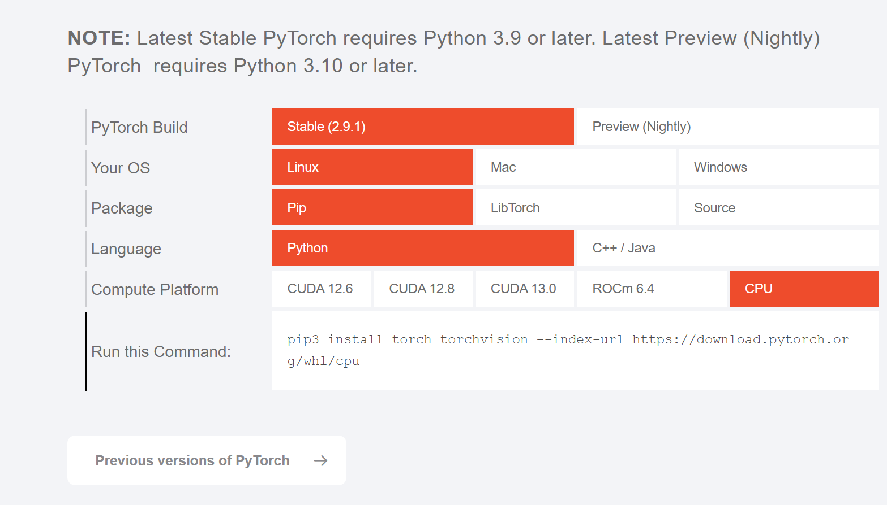

## Let's setup environment here

### create env

1. install  [anaconda](https://www.anaconda.com/download/success) or [miniconda](https://docs.conda.io/en/latest/miniconda.html)
   
2. install python common packages

```bash
conda create -n fz2h_course python=3.10  
```

If you are from china(mainland):

```bash
conda activate fz2h_course
pip install numpy pandas matplotlib opencv-python -i https://pypi.tuna.tsinghua.edu.cn/simple
```

else:

```bash
conda activate fz2h_course
pip install numpy pandas matplotlib opencv-python 
```

3. install pytorch
   If you only have cpu:

```bash
conda activate fz2h_course
pip install torch torchvision --index-url https://download.pytorch.org/whl/cpu
```

If you have nvidia gpu (e.g., RTX 3060 etc):

Use the command to check your gpu version:

```
nvidia-smi
```

Select the correct pytorch version:



```bash
conda activate fz2h_course
pip install torch torchvision --index-url https://download.pytorch.org/whl/cu118
```
