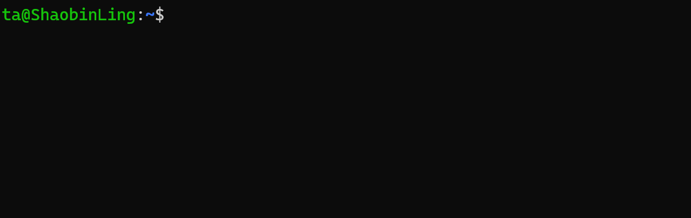

# Quick Start Guide to Linux

Linux is an open-source operating system, and its kernel was created by Linus Torvalds in 1991.

Many companies and organizations build their own Linux distributions based on the Linux operating system, such as Google, Red Hat, and Ubuntu.

Currently, the ROS system mainly runs on the Ubuntu operating system, and Ubuntu itself is based on the Debian Linux distribution.

Therefore, if you want to deeply learn and practice robotics, it is best to install the Ubuntu operating system on your own computer, using WSL or a virtual machine such as VirtualBox or VMware.

More importantly, most artificial intelligence environments today are based on the Ubuntu operating system. For this reason, learning and practicing robotics is best done in an Ubuntu environment.

## Terminal


First, we need to get familiar with something: the terminal.

The terminal is a text-based interface where users can enter commands, and the operating system executes corresponding actions based on those commands.

In the Ubuntu operating system, the terminal is a very important tool. Users can run various commands in the terminal, such as installing software, configuring the system, and running programs.

By using the terminal shortcut **Ctrl + Alt + T**, you can open an interface similar to the one shown below:



In this figure, `ta` is the username, the part after the `@` symbol is the hostname (`ShaobinLing`), `:` is a separator, and `~` represents the current user’s home directory, which is also the path where the terminal is currently located.

You can type commands in this black window to perform corresponding operations. For example, entering the `ls` command lists the files and directories in the current directory.

You can also use the `cd` command to change the current directory. For example, entering:

```bash
cd ~/
```

will switch to the current user’s home directory.

### Basic Linux Commands Experiment (Step by Step)

#### ⚠️ Safety Notice for the Experiment (Very Important)

In this experiment, you will encounter **commands that will actually modify files and directories**, so it is crucial to read the following:

- **`rm` and `mv` will directly delete or move files.**
- **`rm -rf` is extremely dangerous; if you write the path incorrectly, data cannot be recovered.**
- **This experiment only allows operations within `~` (your home directory).**
- **It is strictly forbidden to run `rm -rf` in system directories like `/`, `/home`, `/usr`, etc.**
- **If system damage occurs due to incorrect operations, you will bear the responsibility for repair or compensation.**

👉 **Feel free to ask questions if you don't understand something.**

---

#### I. Experiment Goal

Through a complete mini experiment, you will learn the following:

- The **concept of paths** in the Linux terminal.
- Common file/directory operations:  
  `ls mkdir touch cp mv rm find cat`
- Using `gedit` to create and edit files.
- Running Python programs in different ways and understanding:
  - Relative paths.
  - Absolute paths.
  - `~` (home directory).
- Basic system and network commands: `ping`, `top`.
- How to execute a **complete automation script**.

---

#### II. Experiment 1: Manual Operations (Must be Done First)

##### 1️⃣ Check Your Current Location

```bash
pwd
ls
```

Make sure you are in your **home directory (~)**.

---

##### 2️⃣ Create an Experiment Workspace

```bash
mkdir linux_exp
cd linux_exp
ls
```

---

##### 3️⃣ Create Files and Directories

```bash
mkdir src
touch note.txt
ls
```

---

##### 4️⃣ Use `gedit` to Create a Python File

```bash
gedit src/hello.py
```

In the opened editor, type and save:

```python
print("Hello Linux")
```

---

##### 5️⃣ Use `find` to Search for Files

```bash
find ~ -name "hello.py"
```

Observe the output path.

---

##### 6️⃣ View File Content

```bash
cat src/hello.py
```

---

##### 7️⃣ Copy, Move, and Delete Files (Be Careful)

```bash
cp src/hello.py hello_copy.py
mv hello_copy.py hello_moved.py
rm hello_moved.py
ls
```

⚠️ **Do not use `rm -rf /` or randomly delete directories.**

---

#### III. Experiment 2: Running Python and Understanding Paths

Make sure you are still in the `~/linux_exp` directory:

```bash
pwd
```

##### Method 1: Relative Path

```bash
python src/hello.py
```

---

##### Method 2: Home Path

```bash
python ~/linux_exp/src/hello.py
```

---

##### Method 3: Absolute Path

```bash
python /home/<username>/linux_exp/src/hello.py
```

> Please replace `<username>` with the username in your terminal (the string before the `@` symbol).

---

##### Reflection

- Why do all three methods work?
- If you `cd ~`, which ones will still work?

---

#### IV. Experiment 3: System and Network Commands (Observe Only)

##### View Processes (Press `q` to Quit)

```bash
top
```

---

##### Test Network (Ctrl + C to Stop)

```bash
ping baidu.com
```

---

#### V. Experiment 4: One-Click Automation Script (Key Focus)

##### 1️⃣ Create the Script File

```bash
cd ~
gedit run_linux_exp.sh
```

Write the following content and save:

```bash
#!/bin/bash

echo "=== Linux Basic Experiment Script Start ==="

cd ~

echo "[1] Creating experiment directory"
mkdir -p linux_script_exp/src

echo "[2] Creating Python file"
cat << EOF > linux_script_exp/src/hello.py
print("Hello from script")
EOF

echo "[3] Searching for the file"
find ~/linux_script_exp -name "hello.py"

echo "[4] Viewing file content"
cat linux_script_exp/src/hello.py

echo "[5] Running Python (relative path)"
cd linux_script_exp
python src/hello.py

echo "[6] Running Python (absolute path)"
python ~/linux_script_exp/src/hello.py

echo "[7] Creating, copying, moving, and deleting files"
touch test.txt
cp test.txt test_copy.txt
mv test_copy.txt test_moved.txt
rm test_moved.txt

echo "=== Script Execution Complete ==="
```

---

##### 2️⃣ Add Execute Permissions

```bash
chmod +x run_linux_exp.sh
```

---

##### 3️⃣ Execute the Script

```bash
./run_linux_exp.sh
```

Observe the output at each step and understand the script's content.

---

#### VI. Experiment Summary

In this experiment, you have used and understood the following:

##### 📌 Three Ways to Write Paths

- **Absolute Path**  
  `/home/<username>/linux_exp/src/hello.py`

- **Relative Path**  
  `src/hello.py`

- **Home Path**  
  `~/linux_exp/src/hello.py`

👉 **Command success depends on: where you are and how you write the path.**

---

#### VII. Check List (Self-check)

- [ ] I know what `pwd` does.  
- [ ] I will not casually use `rm -rf`.  
- [ ] I can understand each command in the script.  
- [ ] I understand why the same Python file can be executed in multiple ways.

