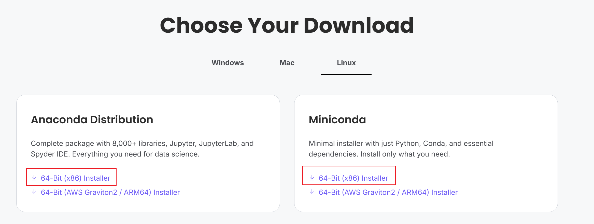

# Welcome to Robotics Learning Hub

This is a comprehensive guide to Robotics Operating System (ROS), Object Detection, and Path Planning algorithms.


Although GPT or vibe-coding can perform knowledge-based Q&A and generate code, it's undeniable that the content they generate can contain factual errors. For students with zero foundation, if they lack even the basic knowledge needed to ask questions and have insufficient ability to distinguish between true and false information, then they won't be able to conduct knowledge-based Q&A or modify code effectively.

Our goal is to make it work right out of the box, so that people can understand the algorithms just by reading the articles and demos.

We're currently developing ROS-related content and aim to publish daily updates. To stay informed about our latest releases, please subscribe to our Bilibili channel [Fz2h](https://space.bilibili.com/671663023){ .md-button }.

## Featured Topics

- **ROS**: Learn the fundamentals of robot programming.
- **YOLO**: Master real-time object detection.
- **Path Planning**: Explore algorithms for autonomous navigation.

[Get Started with ROS](ros/index.md){ .md-button .md-button--primary }


## Let's setup environment here 


### create env
1. install  [anaconda](https://www.anaconda.com/download/success) or [miniconda](https://docs.conda.io/en/latest/miniconda.html)


2. install python common packages

``` bash
conda create -n fz2h_course python=3.10  
``` 

If you are from china(mainland):

``` bash
conda activate fz2h_course
pip install numpy pandas matplotlib opencv-python -i https://pypi.tuna.tsinghua.edu.cn/simple
```

else:

``` bash
conda activate fz2h_course
pip install numpy pandas matplotlib opencv-python 
```

3. install pytorch
If you only have cpu:

``` bash
conda activate fz2h_course
pip install torch torchvision --index-url https://download.pytorch.org/whl/cpu
```
If you have nvidia gpu (e.g., RTX 3060 etc): 

Use the command to check your gpu version:
```
nvidia-smi
```

Select the correct pytorch version:


``` bash
conda activate fz2h_course
pip install torch torchvision --index-url https://download.pytorch.org/whl/cu118
```

## Course update log 
- 2025-12-16: initialize ros tutorial
- 2025-12-17: Setup environment：python