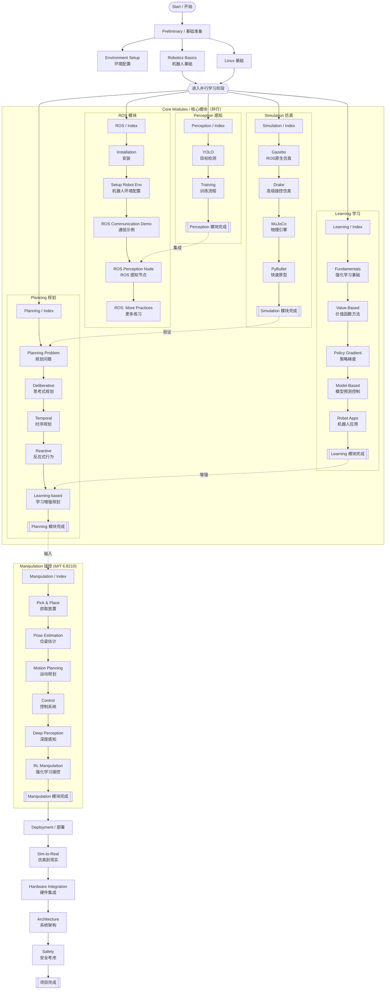

# 欢迎来到 Fz2h 的机器人课程网页

这是一个关于机器人操作系统（ROS）+ 视觉感知的综合工程指南。

该课程主要讲解目前相对比较新颖的算法是如何部署到机器人上，希望能在课程项目设计、毕业设计、科研、机器人入门上提供一些帮助。

在自学材料方面，当前GPT/vibe-coding虽然大大降低了自学的门槛，但对于0基础的同学来说，如果连提问的基础知识都没有，判别知识真伪的能力也不足，将导致自学的效果不佳。同时缺乏实际的工程目标更是让人容易放弃学习以及在学习的过程中感觉非常迷茫。所以我们以开发一个比较完整的机器人项目为目的设计课程内容。

原则上，我们不重复造轮子，不会重复讲解已经存在的教程。相反，我们会提供相应的比较好的教程链接。
例如，目前线上的ROS教程很多，所以我们的教程并不会涉及太多的ROS细节，但是会提及到比较关键的知识点和整体的工程逻辑。当然，这个也是看反响情况的。

视频实操内容会更新在bilibili频道:

[Fz2h](https://space.bilibili.com/671663023){ .md-button .md-button--primary }

## 项目概览

目前我们构建的项目是基于ROS框架将目标识别算法以及前沿点探索算法部署到单台机器人上。

## 课程模块

### [机器人基础](robotics_basics/index.zh.md)
机器人学的数学基础，涵盖正逆运动学、动力学、坐标变换和DH参数。

### [ROS机器人操作系统](ros/index.zh.md)
ROS通信机制、机器人环境配置和感知节点开发。

### [感知模块](perception/index.zh.md)
YOLO目标检测、模型训练和视觉感知系统。

### [仿真环境](simulation/index.zh.md)
Gazebo、Drake、MuJoCo、PyBullet等仿真框架。

### [机器人操控 (MIT 6.8210)](manipulation/index.zh.md)
MIT Russ Tedrake 教授的操控课程，涵盖感知、规划、控制和强化学习。

### [规划模块](planning/index.zh.md)
任务规划、时序逻辑、反应式行为和规划与学习结合。

### [强化学习](learning/index.zh.md)
强化学习基础、价值函数、策略梯度、模型预测控制。

### [部署上线](deployment/index.zh.md)
从仿真到真实机器人的部署，硬件集成、系统架构和安全考虑。

## 课程路线图

### 基础准备
- [Python环境配置](Preliminary/Environment_setup.zh.md) - 10分钟快速配置
- [Linux快速入门](Preliminary/Linux.zh.md) - 必备Linux技能

### 并行学习路径

## 课程更新日志

- 2026-04-26：更新强化学习模块
- 2026-04-26：更新机器人操控模块（MIT 6.8210）
- 2026-04-26：新增规划模块（任务规划、时序逻辑）
- 2026-04-26：更新仿真模块（Gazebo, Drake, MuJoCo, PyBullet）
- 2026-04-26：更新部署模块（Sim-to-Real, 硬件集成）
- 2025-12-20：构建视觉感知节点
- 2025-12-18：Linux快速入门
- 2025-12-17：搭建环境：Python
- 2025-12-16：初始化 ROS 教程
