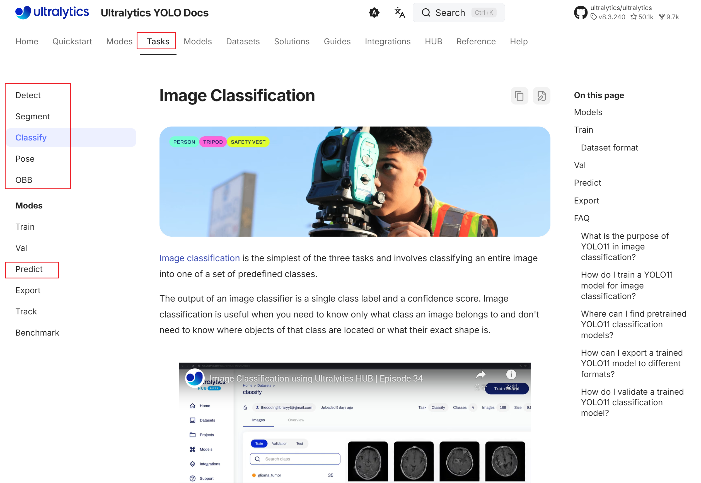
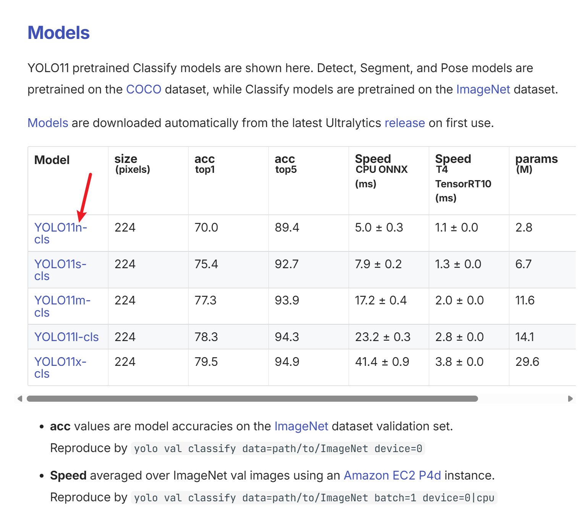
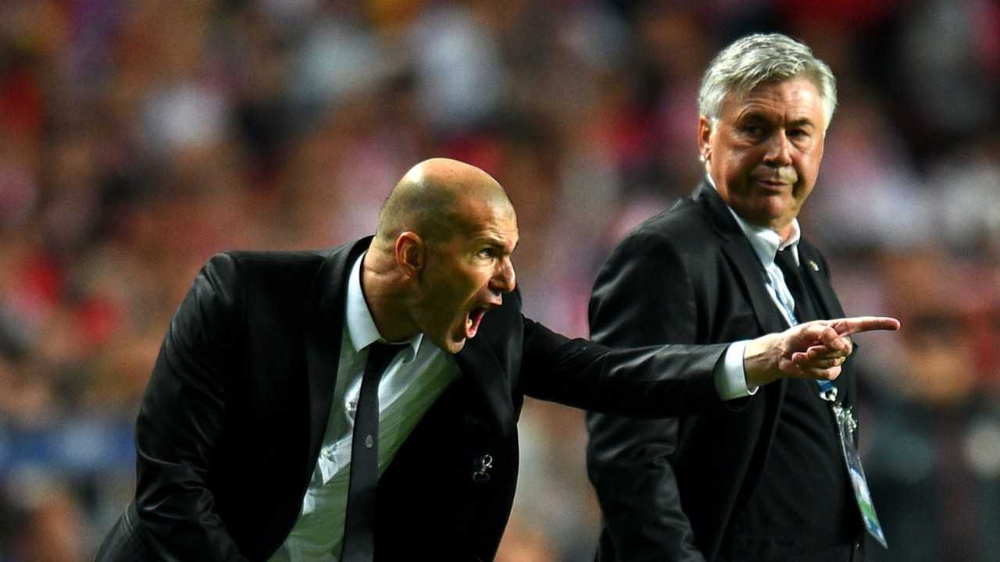

# 如何部署/训练Yolo模型


## YOLO 模型

You Only Look Once (YOLO) 是一种先进的视觉感知模型。
[官网](https://docs.ultralytics.com/)
[官方yolov11介绍](https://docs.ultralytics.com/models/yolo11/#overview)


官方面向不同任务对其进行训练，并分发了预训练模型以给我们下载并部署到本地。


## 配置Python环境


在前面的课程中，我们已经配置了Python环境，这里我们直接使用之前的环境。
``` bash
conda activate fz2h_course
pip install ultralytics
```
**Tips**:
[官方库下载教程](https://docs.ultralytics.com/quickstart/#conda-docker-image)
也提供不下载依赖或者手动下载依赖的方法。


## 下载yolo模型

以下载[分类模型](https://docs.ultralytics.com/tasks/classify/)为例子：

你可以看到这里有很多其他的任务


页面向下滚动看到，对应的模型，点击即可下载。示意图中下载的是最小的



[这里可以获取到yolov面向不同任务类型的模型](https://docs.ultralytics.com/tasks/)

## 使用yolo模型进行测试

测试图片为:



```python
from ultralytics import YOLO

# Load a model
model = YOLO("<path_to_your_model>/yolo11s-cls.pt")  

# Run batched inference on a list of images
results = model(["zidane.jpg"])  # return a list of Results objects

# Process results list
for result in results:
    boxes = result.boxes  # Boxes object for bounding box outputs
    masks = result.masks  # Masks object for segmentation masks outputs
    keypoints = result.keypoints  # Keypoints object for pose outputs
    probs = result.probs  # Probs object for classification outputs
    obb = result.obb  # Oriented boxes object for OBB outputs
    result.show()  # display to screen
    result.save(filename="zidane1.jpg")  # save to disk
```


## 训练自定义数据

后续进行