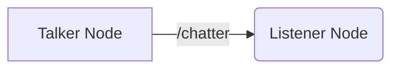

# Topics & Nodes

Understanding the communication between nodes via topics.

## Example

One node publishes messages to a topic, while another node subscribes to receive them.

```mermaid
graph LR
    A[Talker Node] -->|/chatter| B(Listener Node)
```
