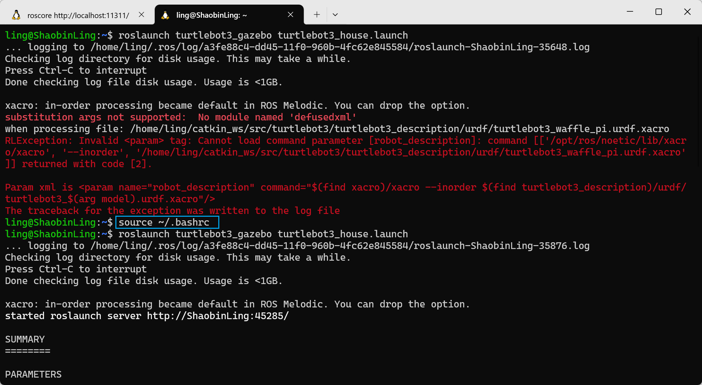

# Install and Set Up ROS Noetic + Gazebo / Create ROS Workspace

## 🧱 1. Install and Set Up ROS Noetic + Gazebo / Create ROS Workspace

1. **Install ROS Noetic**
   If not yet installed, use the [Fishros one-click installation script](https://fishros.org.cn/forum/topic/20/%E5%B0%8F%E9%B1%BC%E7%9A%84%E4%B8%80%E9%94%AE%E5%AE%89%E8%A3%85%E7%B3%BB%E5%88%97) to install ROS Noetic.
   
   Follow the recommended options, you can refer to the following selections:

   [1]: One-click installation (recommended): ROS (supports ROS/ROS2, Raspberry Pi, Jetson)

   [1]: Change system sources before continuing installation

   [1]: Auto-test and select the fastest source

   [1]: USTC mirror source (recommended for domestic users in China)

   [3]: noetic (ROS1)

   [1]: noetic (ROS1) desktop version

   Install Gazebo (Noetic defaults to Gazebo 11):

   ```bash
   sudo apt install ros-noetic-gazebo-*
   sudo apt install ros-noetic-gazebo-ros-pkgs ros-noetic-gazebo-ros-control
   ```

2. **Create Workspace**

   ```bash
   mkdir -p ~/catkin_ws/src
   cd ~/catkin_ws/src
   ```

3. **Clone Repositories**

   ```bash
   git clone -b noetic https://github.com/ROBOTIS-GIT/turtlebot3.git
   git clone -b noetic https://github.com/ROBOTIS-GIT/turtlebot3_msgs.git
   git clone -b noetic https://github.com/ROBOTIS-GIT/turtlebot3_simulations.git
   ```

4. **Build**
   Open a new terminal.
   ```bash
   cd ~/catkin_ws
   catkin_make
   ```

5. **Environment Variables**

   Automatically load the workspace environment (add to `.bashrc`):

   ```bash
   echo "source ~/catkin_ws/devel/setup.bash" >> ~/.bashrc
   source ~/.bashrc
   ```

   Specify the TurtleBot3 robot model (options: `burger` / `waffle` / `waffle_pi`):

   ```bash
   echo "export TURTLEBOT3_MODEL=burger" >> ~/.bashrc
   source ~/.bashrc
   ```

---

## 🚀 2. Launch Gazebo Simulation

### ✅ Launch Empty Environment

Open a terminal:

```bash
roslaunch turtlebot3_gazebo turtlebot3_empty_world.launch
```

This will start Gazebo and load an empty world with the TurtleBot3 robot model.

---

### 🌍 Launch World with Obstacles / Environments

For example, to launch the default world:

```bash
roslaunch turtlebot3_gazebo turtlebot3_world.launch
```

Or a house environment:

```bash
roslaunch turtlebot3_gazebo turtlebot3_house.launch
```

Note: Loading the `house` world for the first time may take longer as it downloads models.

---

## 🎮 3. Control Robot Movement

To control the robot in Gazebo:

### 🕹️ Keyboard Control

Open a new terminal (**keep Gazebo running**), then:

```bash
roslaunch turtlebot3_teleop turtlebot3_teleop_key.launch
```

This enables keyboard control (W/A/S/D for forward/backward/rotation), spacebar to stop, etc.

---

## 🧠 4. Control Robot Using ROS Nodes

If you want to write your own ROS node to publish velocity commands:

### 📡 ROS Topic Control Example

In another terminal:

```bash
rostopic pub /cmd_vel geometry_msgs/Twist '{linear: {x: 0.2, y: 0.0, z: 0.0}, angular: {x: 0.0, y: 0.0, z: 0.5}}'
```

This makes the robot move forward and rotate slowly (just an example, modify according to your code).
You can also write a node to publish `geometry_msgs/Twist` to `/cmd_vel`.

---

## 🧩 5. Optional: Launch Obstacle Avoidance / SLAM / Navigation

Official examples also include preset launch files:

```bash
roslaunch turtlebot3_gazebo turtlebot3_simulation.launch
```

This launches the simulation environment with obstacle avoidance, navigation, and other nodes (depending on which packages you've installed).

---

## 🛠️ Common Issues & Notes

✔ **Cannot find launch file**
Ensure the workspace is properly compiled and sourced, otherwise Gazebo launch will report package not found errors.

✔ **ROS environment not loaded**
Each new terminal must run `source ~/catkin_ws/devel/setup.bash` to use turtlebot3 commands.

✔ **Gazebo shows blank screen**
May be due to version mismatch between Gazebo and ROS libraries. Confirm ROS Noetic is installed with the corresponding Gazebo 11. (Installing via apt usually ensures compatibility)

---

If you'd like, I can also write you **a complete ROS Python example program** to make the TurtleBot3 automatically execute simple actions in Gazebo (such as obstacle avoidance or moving in a straight line). Would you like that?

## Additional Supplementary Content

### 1. **~/.bashrc and `source ~/.bashrc`**

- **~/.bashrc file**
  - **~/.bashrc** is a hidden configuration file located in the Linux user's home directory (`~` represents the current user's home directory). It's one of the Bash shell configuration files (the default command-line interpreter), typically used to store user environment variables, aliases, shell configurations, etc.
  - For example, you can set commonly used command aliases or change the command prompt style, or even set paths to help the system recognize new programs and scripts.
  - Common content:
    ```bash
    export PATH=$PATH:/opt/myprogram/bin
    alias ll='ls -alF'
    ```
    Here `export PATH` adds a new path to the system's environment variables, and `alias` creates a simplified command.

- **`source ~/.bashrc`**
  - When you modify the `~/.bashrc` file, changes don't take effect immediately. If you want the new configuration to take effect immediately, execute in the command line:
    ```bash
    source ~/.bashrc
    ```
  - The `source` command reads and executes the specified file's content, so you don't need to restart the terminal window to apply the new settings in the current session.

  In Windows system's Ubuntu terminal, it doesn't source ~/.bashrc automatically. So using it to execute some scripts may show errors, such as: `substitution args not supported: No module named 'defusedxml'`.

  Therefore, when using this terminal to execute ROS-related commands, you need to source ~/.bashrc first.
  Operation shown in the image:
  


### 2. **ROS File Structure (`/opt/ros/`)**

- **ROS (Robot Operating System)** is an open-source robot operating system used for developing robotic applications. In Linux systems, the ROS file structure is typically located in the `/opt/ros/` directory.
  
  The content structure under the `/opt/ros/` directory is as follows:
  - **/opt/ros/noetic/** (or other versions, such as `melodic`, `foxy`)
    - **bin/**: Contains ROS command-line tools, such as `roscore`, `roslaunch`.
    - **include/**: Contains ROS library header files.
    - **lib/**: Contains ROS library files.
    - **share/**: ROS packages and resource files directory, usually containing various ROS packages (e.g., `roscpp`, `rospy`) and some tool configuration files.

  Under `/opt/ros/`, there are usually specific version-related folders, such as `noetic`, which is a version of ROS 1. In this directory, you can find ROS core tools, packages, and libraries.

### 3. **ROS Package Naming Conventions and Installation Methods**

- **ROS Package Naming Conventions**
  - ROS package naming typically follows these rules:
    - **Lowercase letters and underscores**: For example, `my_robot_package`.
    - **Clear functionality**: Package names are usually directly related to the package's function, such as `ros_control`, `ros_comm`, etc.
    - **Version numbers**: Some package names may include version information, especially in cross-version development, where you might see naming like `my_package_v2`.

- **How to install ROS packages using `apt`**
  - In Ubuntu systems, ROS packages can be installed directly through the `apt` package